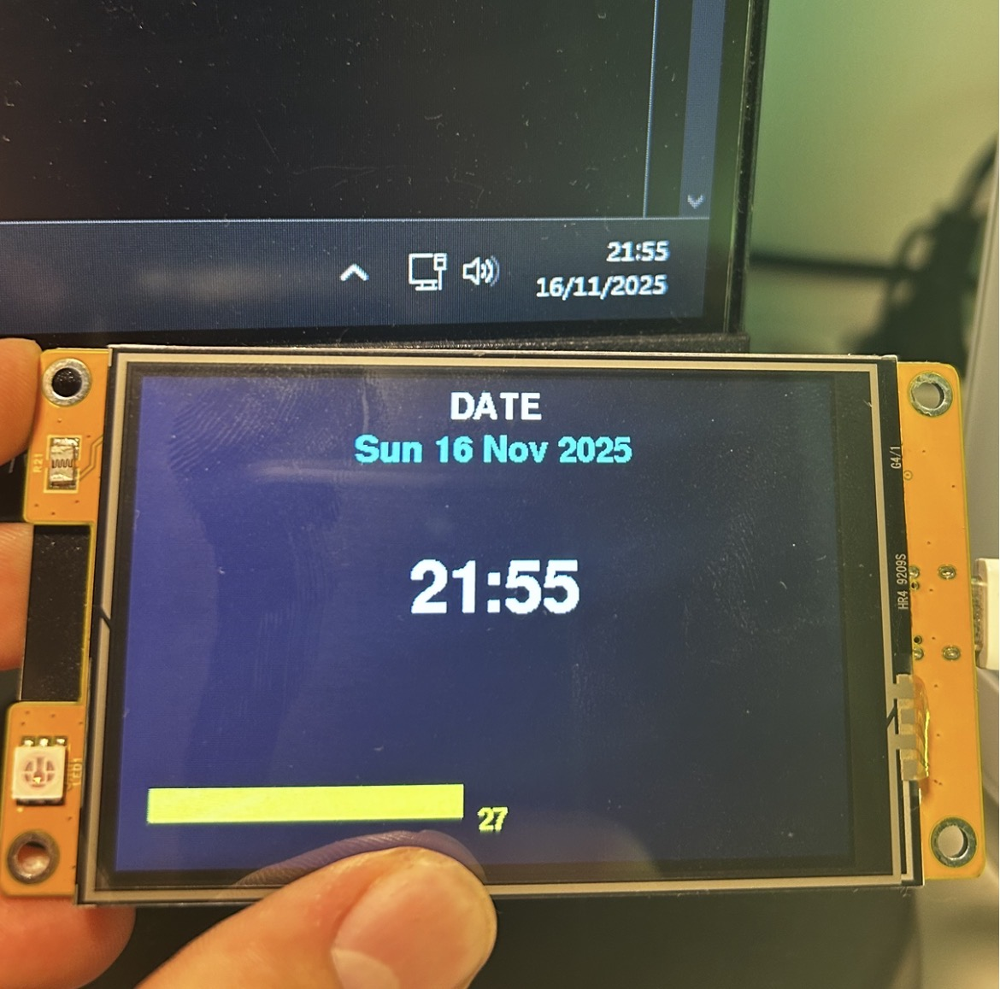

# esp32-ST7796U-clock
clock on the esp ST7796U

photo:

how to use:
install TFT_eSPI library
use your user_setup (if dont work use the one from my web server repo)

copy code (normal or inverted)
flash esp by holding boot
